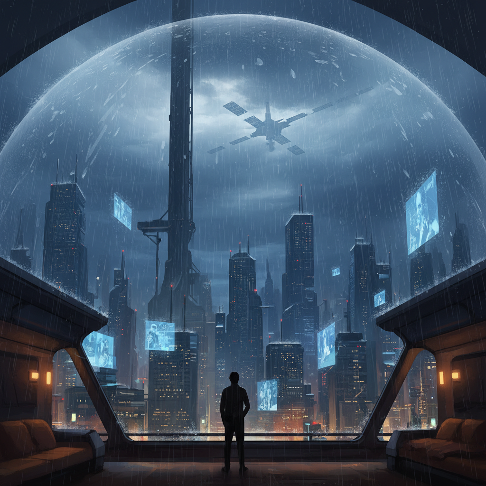

# 비의 행성

*— 2026년 5월 30일의 기록을 SF 소설로 재구성하다*

---

저녁 19시 02분, 도시 상공의 기상 제어 위성 *클라우드-9*이 예고 없이 침묵했다.

나는 오늘 저녁, 궤도 정거장 *메리디안*의 전망 라운지에서 오랜 친구를 만나기로 되어 있었다. 인공 중력이 가장 부드럽게 흐르는 그 시간, 우리는 지구를 내려다보며 식사를 할 예정이었다. 약속은 3주 전부터 잡혀 있었고, 나는 그 만남을 위해 일정의 절반을 비워 두었다.

그러나 도시는 비를 맞았다.

기상 제어 시스템이 다운된 순간, 대기권 상층에 묶여 있던 수십억 톤의 응축 수분이 한꺼번에 풀려났다. 도시를 감싸던 투명 돔의 표면을 따라 거대한 빗줄기가 흘러내렸고, 지상과 궤도를 잇는 자기 부상 엘리베이터는 안전 프로토콜에 따라 전면 운행을 멈췄다.

> *"승강 시스템 일시 정지. 기상 안정화까지 모든 궤도 이동이 취소되었습니다."*

단말기 위로 떠오른 푸른 홀로그램 문자가 조용히 명멸했다. 약속은 취소되었다. 친구의 메시지가 도착했다 — *"다음에 보자, 비가 그치면."*

나는 잠시 창가에 서서, 한 번도 본 적 없는 비를 바라보았다. 기상이 통제되는 이 도시에서 비는 사고이자 사건이었다. 사람들은 처마 아래 멈춰 서서, 잊고 있던 하늘의 무게를 올려다보았다.

그리고 나는 집으로 돌아왔다.

거주 모듈의 문이 닫히자, 도시의 소음이 차단되고 빗소리만이 외벽을 두드렸다. 합성 조명을 가장 낮은 단계로 내리고, 나는 그저 쉬기로 했다. 아무것도 하지 않는 것 — 그것이 오늘 나에게 허락된 가장 사치스러운 일이었다.

빗소리는 의외로 좋았다. 통제되지 않은 자연의 리듬이, 완벽하게 설계된 이 도시 안에서 유일하게 불규칙한 노래를 부르고 있었다.

약속은 깨졌지만, 어쩌면 이 비는 오래전 누군가가 나에게 보낸 휴식의 신호였는지도 모른다.

나는 의자에 몸을 묻고, 천천히 눈을 감았다.

*— 기록 종료.*
