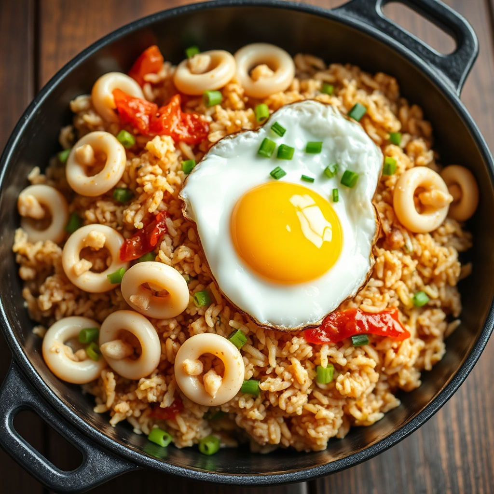

# 🦑 오징어 볶음밥

> 쫄깃한 오징어와 고슬고슬한 밥이 불맛을 머금어, 한 그릇으로 든든한 매콤 감칠맛 볶음밥이에요.

- **작성일**: 2026-06-23
- **조리 시간**: 약 20분
- **난이도**: ⭐⭐ (쉬움)
- **분량**: 2인분

## 🧺 재료

### 주재료
| 재료 | 수량 |
|------|------|
| 손질 오징어 | 1마리 (약 200g) |
| 밥 (찬밥 추천) | 2공기 (약 400g) |
| 양파 | 1/2개 |
| 당근 | 1/4개 |
| 대파 | 1대 |
| 계란 | 2개 (반숙 후라이용) |
| 식용유 | 2큰술 |

### 양념
| 재료 | 수량 |
|------|------|
| 고추장 | 1큰술 |
| 고춧가루 | 1큰술 |
| 간장 | 1큰술 |
| 다진 마늘 | 1큰술 |
| 설탕 | 1작은술 |
| 굴소스 | 1작은술 (선택) |
| 참기름 | 1작은술 |
| 통깨 | 약간 |

> **밥은 찬밥이 좋아요.** 갓 지은 밥은 수분이 많아 질어지기 쉬워요. 따뜻한 밥뿐이라면 넓게 펼쳐 한 김 식혀 쓰세요.

## 👨‍🍳 조리 순서

1. **재료 손질 (약 6분)**: 오징어는 안쪽에 사선 칼집을 살짝 넣고 한입 크기로 썬다. 양파·당근은 잘게 깍둑썰기, 대파는 송송 썬다.
2. **양념 만들기 (약 1분)**: 고추장·고춧가루·간장·다진 마늘·설탕·굴소스를 작은 그릇에 모두 섞어 양념장을 만든다.
3. **파기름 내기 (약 2분)**: 달군 팬에 식용유 2큰술을 두르고 대파 절반을 넣어 약한 불에서 향이 올라올 때까지 볶는다.
4. **오징어 볶기 (약 3분)**: 불을 센 불로 올리고 오징어를 넣어 표면이 하얗게 익을 때까지 빠르게 볶는다. *오래 볶으면 질겨지니 주의!* 익으면 잠시 덜어둔다.
5. **채소 볶기 (약 2분)**: 같은 팬에 양파·당근을 넣고 숨이 죽을 때까지 볶는다.
6. **밥 + 양념 (약 3분)**: 밥과 양념장을 넣고 주걱으로 누르듯 펼쳐가며 골고루 비벼 볶는다. 밥알이 양념을 머금고 살짝 고슬해지면 좋다.
7. **마무리 (약 2분)**: 덜어둔 오징어와 남은 대파를 다시 넣어 한 번 더 볶고, 불을 끈 뒤 참기름·통깨를 둘러 섞는다.
8. **담기**: 그릇에 담고 반숙 계란 후라이를 얹으면 완성! 노른자를 터뜨려 비벼 먹으면 더 부드러워요.

## 💡 요리 팁

- **오징어는 센 불에 짧게.** 강한 불에서 빠르게 볶아야 쫄깃함이 살아요. 오래 익히면 고무처럼 질겨집니다.
- **칼집**을 넣으면 양념이 잘 배고 익으면서 모양이 동그랗게 말려 보기에도 예뻐요.
- **불맛**을 더 내고 싶다면 밥을 넣은 뒤 팬을 잘 흔들지 말고 30초쯤 그대로 눌러 누룽지처럼 살짝 태워주세요.
- **매운맛 조절**: 아이와 함께 먹는다면 고추장·고춧가루를 절반으로 줄이고 굴소스를 조금 더 넣어 감칠맛으로 채우세요.
- **남은 오징어**는 데쳐서 초고추장에 찍어 먹거나, 라면·찌개에 넣어도 좋아요.

---

> 🖼️ 썸네일은 **fal.ai (FLUX schnell)** 이미지 생성 API로 만들었어요. 이미지 파일은 [`썸네일/오징어볶음밥.jpg`](썸네일/오징어볶음밥.jpg)에 있습니다.
