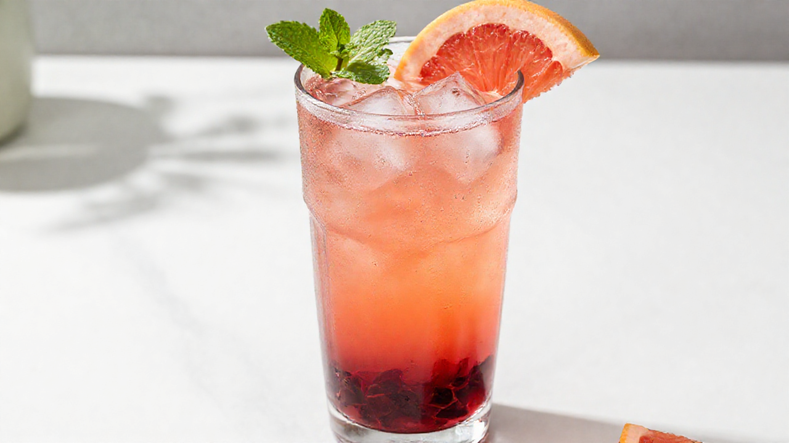

# 자몽 히비스커스 에이드

> ⏱️ 만드는 시간: 10분 | 🥤 1잔 | 난이도: ⭐ 쉬움

푹푹 찌는 한여름 오후에 딱 맞는 여름 시그니처 에이드예요. 바닥에 깔린 루비빛 히비스커스가 위로 갈수록 코럴핑크로 번지는 그라데이션이 예쁘고, 자몽의 쌉쌀한 끝맛과 히비스커스의 새콤함이 만나 끝까지 물리지 않습니다.

## 📝 재료 (톨 사이즈 400ml 잔 기준)
- 자몽청 — 60ml (약 4큰술)
- 히비스커스 티백 — 1개
- 뜨거운 물 — 60ml (농축액용)
- 탄산수 — 200ml (차갑게)
- 얼음 — 잔 가득 (약 200g)
- 자몽 슬라이스 — 1조각 (가니시)
- 애플민트 — 1줄기 (가니시, 없어도 됨)

> 💬 시판 재료로 더 간단히: 히비스커스 티백 + 뜨거운 물 대신 **히비스커스 농축액(시럽) 15ml**을 그대로 써도 됩니다. 우리고 식히는 과정이 통째로 빠져서 3분이면 완성돼요.

## 👨‍🍳 만드는 법
1. 히비스커스 티백을 뜨거운 물 60ml에 **딱 5분만** 우려 진한 농축액을 만듭니다. 티백을 꾹 짜지 말고 그냥 건져내세요. (5분)
2. 농축액을 얼음물에 담가 **완전히 차갑게** 식힙니다. 이게 층을 만드는 핵심이에요. (3분)
3. 잔 바닥에 자몽청 60ml과 식힌 히비스커스 농축액을 붓고 가볍게 섞습니다. 설탕이 많아 무거운 이 베이스가 아래에 깔려 루비빛 층이 됩니다. (30초)
4. 그 위로 얼음을 잔 끝까지 가득 채웁니다. 얼음이 적으면 층이 섞여버리니 아끼지 마세요. (30초)
5. 차가운 탄산수 200ml을 **스푼 뒷면에 흘려가며** 얼음 위로 천천히 붓습니다. 그라데이션이 살아나고 탄산도 덜 날아갑니다. (1분)
6. 자몽 슬라이스를 잔 끝에 끼우고 민트를 올려 완성합니다. 마시기 직전에 길게 한 번 저어 드세요. (30초)

## 🍯 자몽청 직접 만들기 (선택)
1. 자몽 2개를 굵은소금으로 문질러 씻고, 껍질과 하얀 속껍질까지 깨끗이 벗겨냅니다. 속껍질이 남으면 쓴맛이 강해져요.
2. 과육만 발라 **400g**을 준비하고, 설탕 **400g**(1:1)과 레몬즙 1큰술을 섞습니다.
3. 열탕 소독한 유리병에 담아 실온에서 하루, 이후 냉장에서 3~5일 숙성시킵니다.
4. 냉장 보관하고 2주 안에 드세요. 위에 뜬 과육까지 함께 떠서 넣으면 씹히는 식감이 살아납니다.

## 💡 꿀팁
- **층이 안 생긴다면** 십중팔구 히비스커스가 아직 미지근한 겁니다. 따뜻한 액체는 대류로 바로 섞여버려요. 얼음물에 담가 완전히 식히세요.
- **떫은맛이 난다면** 히비스커스를 너무 오래 우렸거나 티백을 짠 경우입니다. 5분을 넘기지 마세요.
- **덜 달게** 하려면 자몽청 40ml + 탄산수 220ml로 조절하세요. 자몽청과 탄산수는 **1 : 3~3.5** 비율 안에서 움직이면 밸런스가 무너지지 않습니다.
- **탄산을 오래 유지**하려면 탄산수는 냉장고에서 바로 꺼내 맨 마지막에 붓고, 젓는 건 손님(혹은 나)에게 맡기세요.
- **미리 준비**해둘 땐 자몽청 + 히비스커스 베이스만 섞어 냉장 보관(3일)해두면, 주문이 들어왔을 때 얼음과 탄산수만 부어 30초 만에 완성됩니다.
- **어른용 변형**으로 드라이 진이나 화이트 럼 30ml을 3단계 베이스에 함께 섞으면 그대로 여름 하이볼이 됩니다.
