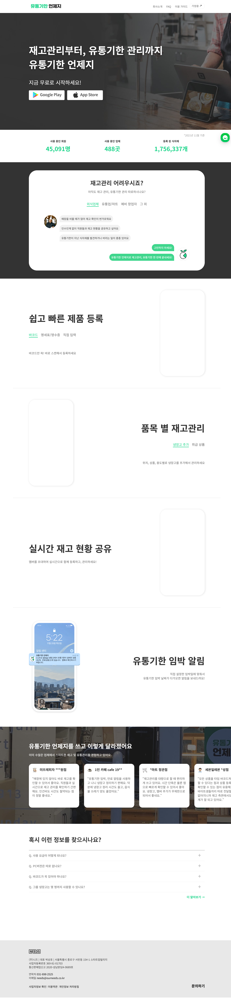
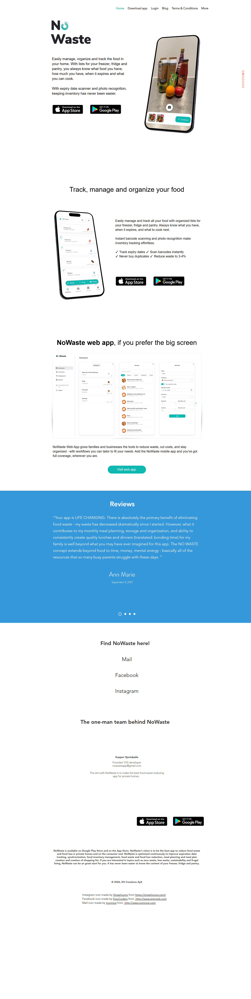
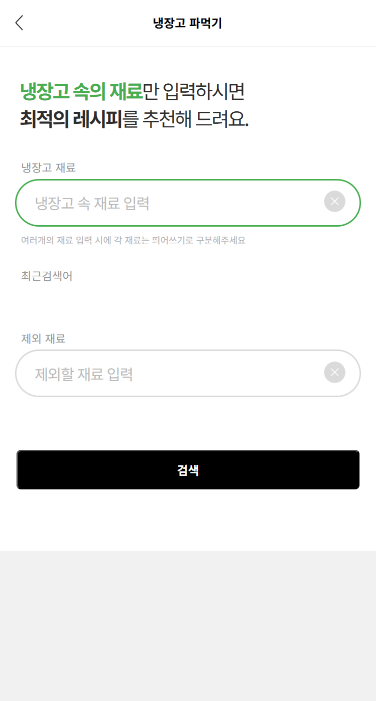

# 경쟁 서비스 리서치 — 「남김없이」

> 조사일: 2026-07-10 · 조사 방법: Chrome MCP로 각 서비스의 랜딩 / 핵심 기능 / 가격 페이지 직접 방문 및 스크린샷 저장
> 스크린샷 위치: `screenshots/`

---

## 0. 조사 대상 선정 이유

「남김없이」는 **스캔 기반 식자재 재고 관리 + 유통기한 추적 + 보유 재료 레시피 추천 + 쿠팡프레시 커머스 연동**을 하나의 플라이휠로 묶는 앱이다. 이 조합을 통째로 하는 경쟁자는 없기 때문에, 핵심 기능축을 셋으로 쪼개 각 축의 대표 주자를 골랐다.

| 구분 | 서비스 | 선정 이유 |
|---|---|---|
| **국내** | **유통기한 언제지** ((주)니즈) | 바코드·영수증 스캔 + 유통기한 임박 알림. 「남김없이」 핵심기능 1·2번과 정면으로 겹치는 국내 유일에 가까운 서비스 |
| **해외** | **NoWaste** (KH Creations ApS, 덴마크) | 재고 리스트 + 바코드/영수증/사진 스캔 + AI 어시스턴트 + 유료 구독. 기능 커버리지가 가장 넓은 해외 정면 경쟁자 |
| **인접 카테고리** | **만개의레시피** (EZHLD) | 레시피 플랫폼. 타깃(요리 담당 주부)이 동일하고 '냉장고 파먹기'가 핵심기능 3번과 겹침. 광고+커머스 수익모델도 참고 대상 |

방문 페이지 목록은 각 서비스 섹션 하단의 **방문 경로** 표에 정리했다.

---

## 1. 유통기한 언제지 (국내)

### 핵심 가치 제안 (Value Proposition)
- B2C 헤드라인: **"냉장고가 가벼워지는 장보기"** / "지긋지긋한 냉장고 정리, 매번 버리기만 하세요?"
- B2B 헤드라인: **"재고관리부터, 유통기한 관리까지"**
- 한 줄 요약: **바코드·영수증만 찍으면 유통기한을 대신 기억해 주는 무료 냉장고 관리 앱.** 식자재뿐 아니라 화장품·영양제·기프티콘·반려동물 사료까지 "유통기한이 있는 것이라면 무엇이든" 등록 대상으로 잡는다.

주의할 점: 랜딩 첫 화면이 **외식업체·마트·예비창업자** 셀렉터로 시작한다. 회사가 B2B(매장 재고관리)로 무게중심을 옮겼고, 가정용은 별도 페이지(`b2c_main.html`)로 분리되어 있다.

### 주요 기능 3개
1. **쉽고 빠른 제품 등록** — 바코드 스캔 / 명세표·영수증 촬영 / 직접 입력 3가지 경로. 영수증 OCR 인식률은 리뷰에서 호평.
2. **유통기한 임박 알림** — 사용자가 임박 기준일(D-n)을 직접 설정하면 그 시점에 푸시 알림.
3. **그룹 냉장고 공유** — 냉장고를 위치·용도별로 **무제한** 생성하고, 인원 제한 없이 멤버를 초대해 실시간 공동 관리.

부가: 자사 '유통기한 언제지 스토어'에서 구매하면 유통기한 포함 제품정보가 냉장고에 **자동 등록**(= 「남김없이」의 쿠팡 연동 아이디어와 같은 발상. 다만 자체 스토어라 상품 수가 제한적).

### 가격 정책
| 항목 | 내용 |
|---|---|
| 요금 | **전 기능 완전 무료** (FAQ 원문: "현재 무료로 제공하고 있으며, 모든 기능에 대해 별도의 비용이 추가되지 않습니다") |
| 냉장고 생성 | 무제한 무료 |
| 멤버 초대 | 인원 제한 없음 |
| 수익화 | 구글플레이 **'광고 포함'** 표기 + 자사 스토어 커머스 + B2B(매장용 '미리' 서비스) 유료 전환 |

### UX 특징
- 3단계 등록 플로우(바코드/영수증/직접입력)를 랜딩에서 탭으로 보여주는 직관적 구조.
- **간편등록(영수증·사진)은 서버 AI 처리 → 등록까지 30초~수분 지연.** 리뷰에서 "한 시간 넘게 등록중"이라는 사례까지 보고됨.
- 간편등록으로 넣은 항목은 **품목명·유통기한 수정 불가**(직접입력만 수정 가능).
- 여러 냉장고를 만들면 **통합 뷰가 없어** 냉장고를 하나씩 눌러야 전체 재고 파악 가능.
- 수량 단위가 '개' 중심 — 박스/통/봉지 같은 실제 장보기 단위나 g/ml 잔량 개념이 없음.
- 랜딩의 지표(회원 45,091명 등)가 **2021년 11월 기준**에서 멈춰 있고, 앱 최신 업데이트 내역은 "버그 수정"뿐. 사실상 B2C는 유지보수 모드로 보인다.

### 방문 경로
| 페이지 | URL | 스크린샷 |
|---|---|---|
| 랜딩 | `ourneeds.co.kr/index.html` | `01-ourneeds-01-landing.png` |
| 핵심 기능(가정용) | `ourneeds.co.kr/b2c_main.html` | `01-ourneeds-02-features-b2c.png` |
| 가격(FAQ) | `ourneeds.co.kr/faq.html` | `01-ourneeds-03-pricing-faq.png` |

---

## 2. NoWaste (해외)

### 핵심 가치 제안 (Value Proposition)
- 헤드라인: **"Easily manage, organize and track the food in your home."**
- 서브: 냉동실·냉장고·팬트리 3개 리스트로 *"내가 뭘 갖고 있고, 얼마나 있고, 언제 상하고, 뭘 요리할 수 있는지"* 를 항상 알게 한다.
- 자체 주장 성과: **"Reduce waste to 3-4%"**, "Never buy duplicates"
- 창업자 1인 개발(덴마크, Kasper Hjortsballe). 비전은 **"가정용 음식물 쓰레기 감축 앱 중 최고가 되는 것."**

### 주요 기능 3개
1. **3분할 인벤토리 + 스캔 입력** — 냉동/냉장/팬트리 리스트. 바코드·영수증·사진 인식으로 초 단위 등록. Pro는 **2억 5,500만 개** 상품 DB 스캐너 제공.
2. **유통기한 정렬·필터 + 기기 간 동기화** — 유통기한/이름/카테고리로 정렬, 보관 위치별 필터, 항목 간 리스트 이동.
3. **AI 어시스턴트** — 말하거나 써서 "이거 넣어줘", "재고 뭐 있어?" 를 처리. 여기에 식단 플래너·쇼핑리스트·레시피가 붙고, 큰 화면용 **웹앱**(Pro 전용)도 제공.

### 가격 정책
| 항목 | 내용 |
|---|---|
| 기본 | **무료** (인벤토리 6개, 아이템 500개까지) |
| NoWaste Pro | **연 $6.99** (자동 갱신 구독, 무료체험 제공) |
| Pro 혜택 | 2.55억 상품 DB 프로 스캐너 · 인벤토리 **무제한** · 저장 한도 500 → **5,000개** · 웹앱 접근 |
| 기타 | 앱 내 결제, 별도 기부(PayPal Donate) 버튼 |

### UX 특징
- **프리미엄 가격대가 매우 낮다**(연 1만 원 미만). 진입장벽을 가격이 아니라 습관으로 본다는 뜻.
- 앱은 정교하지만 **웹사이트는 Wix 원페이지**이고 리뷰 슬라이드가 2017년 것. 마케팅 자산이 낡았다.
- 무료↔Pro 경계가 '기능'이 아니라 **'개수 한도'**(리스트 6개/아이템 500개)로 설계 — 오래 쓸수록 자연스럽게 유료 전환.
- 앱스토어 평점 **4.2 / 746개 평가**(미국), 구글플레이 **5만+ 다운로드**.
- 결정적 한계: **낱개(count) 단위 관리**. 리뷰에 "후무스를 반만 먹었을 때 부분 소비를 기록할 방법이 없다"는 지적이 반복.

### 방문 경로
| 페이지 | URL | 스크린샷 |
|---|---|---|
| 랜딩 | `nowasteapp.com` | `02-nowaste-01-landing.png` |
| 핵심 기능(웹앱) | `business.nowasteapp.com` | `02-nowaste-02-features-webapp.png` |
| 가격(App Store 구독) | `apps.apple.com/.../id926211004` | `02-nowaste-03-pricing-appstore.png` |

---

## 3. 만개의레시피 (인접 카테고리 — 레시피 플랫폼)

### 핵심 가치 제안 (Value Proposition)
- 헤드라인: **"1,000만 이용자의 선택! 대한민국 대표 요리 앱"**
- 핵심 약속: **20만여 개 레시피**와 실사용자 후기로 *"요리 초보도 요리 고수로."*
- 냉장고 파먹기 화면 문구: **"냉장고 속의 재료만 입력하시면 최적의 레시피를 추천해 드려요."**

### 주요 기능 3개
1. **20만+ 레시피 아카이브** — 조리 순서별 이미지, 실사용자 후기, 종류/상황/재료별 분류, 스크랩 폴더.
2. **냉장고 파먹기** — 보유 재료를 띄어쓰기로 입력하면 만들 수 있는 요리를 추천. **제외 재료** 지정 가능. (직접 테스트: `돼지고기 양파 감자` → 결과 **509건**, 고추장찌개 44 · 카레 44 · 짜장밥 30 …)
3. **만개 스토어** — 앱 안에서 식재료·조리도구를 파는 커머스. 신규가입 2만원 쿠폰팩.

### 가격 정책
| 항목 | 내용 |
|---|---|
| 요금 | **무료 + 앱 내 구입**(광고 제거성 아이템) |
| 수익 모델 | 배너·전면 광고(쿠팡 등 제휴 광고) + 만개 스토어 커머스 |
| 규모 | 구글플레이 **4.8 / 14.7만개 리뷰, 500만+ 다운로드** · 앱스토어 **4.4 / 7천개 평가** |

### UX 특징
- **재고를 저장하지 않는다.** 냉장고 파먹기는 인벤토리가 아니라 **일회성 키워드 검색**이다. 쓸 때마다 재료를 다시 타이핑해야 하고, 유통기한·수량 개념이 아예 없다.
- 결과가 **509건**으로 쏟아진다. "무엇을 먹을지 못 정하겠다"는 원래 문제를 풀어주지 못하고 선택 피로를 준다.
- 검색이 사실상 **OR 조건**으로 동작한다는 사용자 지적(리뷰): "치즈 감자"로 검색하면 치즈버거·감자전 같은 무관한 결과가 섞인다.
- 광고 밀도가 높다. 랜딩 페이지 한 장에 광고 iframe 18개(광고 슬롯 6개)가 로드된다. 앱에서는 **쿠팡 광고로 자동 이동해 뒤로가기를 3~4번 눌러야 복귀**한다는 1점 리뷰가 있다.
- 웹은 `www`에 냉장고 파먹기가 없고 **모바일(`m.`) 도메인에만** 존재한다(`www` 경로는 404).

### 방문 경로
| 페이지 | URL | 스크린샷 |
|---|---|---|
| 랜딩 | `10000recipe.com` | `03-10000recipe-01-landing.png` |
| 핵심 기능(냉장고 파먹기) | `m.10000recipe.com/recipe/ingredients.html` | `03-10000recipe-02-features-fridge.png` |
| 핵심 기능(검색 결과) | `.../ingredients_recipes.html?ingredient=돼지고기+양파+감자` | `03-10000recipe-03-features-result.png` |
| 가격(App Store) | `apps.apple.com/kr/.../id494190282` | `03-10000recipe-04-pricing-appstore.png` |

---

## 4. 비교표

### 4-1. 기능 / 가격 / UX 한눈에 보기

| 항목 | 유통기한 언제지 (국내) | NoWaste (해외) | 만개의레시피 (인접) |
|---|---|---|---|
| **핵심 가치 제안** | 냉장고가 가벼워지는 장보기 — 유통기한을 대신 기억 | 집 안 음식을 손쉽게 추적·정리 (폐기율 3~4%로) | 20만 레시피로 요리 초보도 고수처럼 |
| **기능** | 바코드·영수증 스캔 등록 / 임박 알림 / 무제한 그룹 냉장고 · 자사 스토어 자동등록 | 냉동·냉장·팬트리 3분할 인벤토리 / 바코드·영수증·사진 + AI 어시스턴트 / 유통기한 정렬·동기화 · 식단플래너 · 웹앱 | 20만+ 레시피 / 냉장고 파먹기(재료 키워드 검색) / 만개 스토어 커머스 |
| **가격** | **완전 무료** (전 기능·무제한) · 수익은 광고 + 자사 스토어 + B2B | **무료**(리스트 6·아이템 500) → **Pro 연 $6.99** (무제한·2.55억 상품 DB·웹앱) | **무료 + 인앱결제** · 수익은 광고 + 커머스 |
| **UX 특징** | 등록은 3경로로 쉬우나 **간편등록 처리에 30초~수분 지연**, 등록 후 **수정 불가**, 냉장고 통합 뷰 없음 | 스캔·정렬·동기화 완성도 높음. 한도 기반 프리미엄. 다만 **낱개 단위만** 지원(부분 소비 기록 불가) | **재고를 저장하지 않는 일회성 검색**. 결과 509건 과다, 검색이 OR로 동작, **광고 밀도 높음**(랜딩 광고 iframe 18개) |
| **재고(인벤토리) 보유** | O | O | **X** |
| **유통기한 추적** | O (D-n 알림) | O (정렬/필터) | **X** |
| **용량(g/ml) 잔량 차감** | **X** (개수 단위, 박스/봉지 단위조차 없음) | **X** (낱개 단위, 부분 소비 불가) | **X** |
| **보유 재고 기반 레시피** | **X** | △ (레시피/식단플래너 있으나 재고 연동 약함) | △ (재고 없이 매번 재료 재입력) |
| **부족분 커머스 주문** | △ (자사 스토어, 상품 수 제한) | **X** | △ (만개 스토어 / 제휴광고) |
| **한국 시장 적합성** | O | **X** (영어 전용, 한국 바코드·유통기한 표기 미지원) | O |
| **평점 (표본)** | **3.5** / 217개 (구글플레이 KR) | 4.2 / 746개 (앱스토어 US) | 4.8 / 14.7만개 (구글플레이 KR) |

### 4-2. 읽는 법

세 서비스는 「남김없이」가 하나로 묶으려는 고리를 **각자 한 토막씩만** 쥐고 있다.

- **유통기한 언제지**는 *입력과 알림*을 갖고 있지만, 그 다음(**"그래서 뭘 해먹지?"**)이 없다.
- **NoWaste**는 *입력·알림·레시피·식단*까지 갖췄지만, **한국에서 못 쓴다**(영어 전용, 국내 바코드/상품 DB 미지원).
- **만개의레시피**는 *레시피*를 압도적으로 갖고 있지만, **내 냉장고를 모른다.**

그리고 **세 서비스 모두 용량(g/ml) 기반 잔량 차감이 없다.** 「남김없이」 핵심기능 5번은 경쟁자 전원이 비어 있는 칸이다.

---

## 5. 「남김없이」의 차별화 포인트

### 5-1. 경쟁자들의 약점 3가지

**약점 ①. 입력이 '한 번에' 끝나지 않는다 — 그래서 사용자가 이탈한다.**
유통기한 언제지의 간편등록(영수증·사진)은 서버 AI 처리 때문에 30초~수분이 걸리고, 리뷰에는 *"한 시간이 넘었는데도 지금도 등록중"* 이라는 사례가 있다. 게다가 간편등록으로 넣은 항목은 **품목명·유통기한을 나중에 고칠 수도 없다.** NoWaste는 빠르지만 바코드 DB에 없는 상품이 잦고, 앱스토어 리뷰에는 *"20개를 스캔하고 add all을 눌렀더니 앱이 죽고 하나도 저장 안 됐다"* 는 후기가 있다. 결국 레딧에서 사람들은 앱을 버리고 **스프레드시트·화이트보드·마스킹테이프**로 돌아간다 — *"스프레드시트는 1~2일은 가는데 아무것도 몸에 남지 않는다"*(r/homemaking).

**약점 ②. '개수'로만 센다 — 반쯤 쓴 재료를 표현할 방법이 없다.**
세 서비스 어디에도 g/ml 단위 잔량 개념이 없다. NoWaste 리뷰: *"대부분의 낭비는 통째로 버리는 게 아니라 후무스를 다 못 먹는 식의 부분 낭비인데, 부분 소비를 추적할 수 없다."* 유통기한 언제지 리뷰: *"단위를 1개 말고 1박스·1통·1봉지로 해주세요"*(21명 공감), *"하나 쓸 때마다 −체크해서 몇 개 중 몇 개 남았는지 보이면 좋겠다."* 그래서 소비 기록이 수기 작업이 되고, 레딧의 결론은 이렇다 — *"인벤토리는 너무 스트레스다. 뭘 먹을 때마다 폰을 꺼내 차감할 순 없다"*(r/ZeroWaste).

**약점 ③. 재고와 레시피와 장보기가 서로 끊겨 있다.**
만개의레시피의 '냉장고 파먹기'는 인벤토리가 아니라 **일회성 키워드 검색**이다. 매번 재료를 다시 타이핑해야 하고, 유통기한도 수량도 모르며, `돼지고기 양파 감자` 한 번에 **509건**을 던진다. 검색이 OR로 동작해 *"치즈 감자로 검색하면 치즈버거·감자전이 나온다"*는 지적까지 있다. 반대로 유통기한 언제지는 재고는 알지만 레시피가 없어서, 사용자가 리뷰로 *"이 재료로 뭘 해먹을지 메모할 공간이라도 달라"* 고 요청한다. 그리고 온라인 장보기(컬리·쿠팡프레시)가 일상이 된 지금, 유통기한 언제지 사용자는 *"영수증이 없어서 결제 캡처로 올리는데, 아직 받지도 않은 물건이라 유통기한을 찍을 수가 없다"* 고 호소한다.

---

### 5-2. 내가 더 잘할 수 있는 것 3가지

**① '장바구니 한 건 30초' — 쿠팡 구매내역 연동으로 입력 자체를 없앤다.**
경쟁자들은 모두 **사용자가 물건을 받은 뒤에** 스캔한다. 우리는 **결제하는 순간** 품목·용량·유통기한 후보가 서버에서 채워진다. 유통기한 언제지도 자사 스토어에서만 이걸 하지만 상품 수가 제한적이고, 온라인 장보기 이용자는 *"영수증이 없어서 못 쓴다"* 고 이탈한다. 쿠팡프레시라는 국내 최대 장보기 채널에 붙는 순간, 이건 경쟁자가 따라올 수 없는 해자가 된다. MISSION.md의 성공지표 **"장바구니 한 건 전체 30초 이내"** 는 경쟁자의 "품목당 30초~수분"과 정면으로 대비되는 약속이다.
> 단, MISSION.md의 미해결 질문 그대로 **"쿠팡 구매내역에서 용량·유통기한이 실제로 넘어오는가"** 는 아직 검증되지 않았다. 이 가정이 깨지면 차별점 ①이 통째로 무너지므로 **가장 먼저 검증할 항목**이다.

**② 용량(g/ml) 기반 자동 차감 — 경쟁자 전원이 비워둔 칸.**
세 서비스 모두 '개수'만 센다. 우리는 레시피를 만들 때 쓴 양만큼 재고를 자동으로 깎는다. 핵심은 **차감을 사용자에게 시키지 않는 것**이다. 레딧 사용자의 *"먹을 때마다 폰 꺼낼 순 없다"* 는 말은 우리 기능의 근거인 동시에 경고다 — "요리 완료" 한 번으로 레시피에 적힌 분량이 통째로 빠져나가야 하고, 사용자가 g 단위를 손으로 입력하는 순간 우리도 경쟁자와 똑같이 버려진다.

**③ 재고 → 레시피 → 부족분 주문을 하나의 고리로 잇는다.**
만개의레시피는 재고를 모르고, 유통기한 언제지는 레시피가 없다. 우리는 **유통기한 임박 재료를 우선 소진하는 레시피**를 추천할 수 있다 — 이건 재고와 유통기한을 둘 다 가진 우리만 할 수 있는 정렬이다. 509건을 던지는 대신 *"오늘 상하는 애호박부터 쓰는 3개"* 를 내밀 수 있다. 그리고 부족한 재료를 그 자리에서 주문시켜 다음 장보기를 다시 우리 앱으로 끌어온다. 광고로 사용자를 쿠팡으로 튕겨 보내 1점 리뷰를 받는 만개의레시피와 달리, 우리에게 커머스는 **사용자가 원한 행동(부족분 구매)의 완성**이므로 수익과 사용자 이익이 같은 방향을 본다.

---

## 6. 리서치가 드러낸 경고 신호

차별화만큼 중요한, 이번 조사에서 발견한 반대편 사실 세 가지:

1. **이 카테고리는 앱이 없어서가 아니라 습관이 안 만들어져서 실패해 왔다.** 레딧에서 사람들이 최종적으로 쓰는 건 노트앱·화이트보드·구글시트다. *"앱을 쓰면 결국 안 하게 될 것 같다"*(r/ZeroWaste). 입력을 30초로 줄이는 것만으로는 부족하고, **차감·폐기 기록까지 무의식적으로 굴러가야** 한다.
2. **유통기한 확보는 여전히 미해결이다.** 유통기한 언제지는 이 문제를 "유통기한이 보이게 사진을 찍어라"로 풀었고, 그래서 등록이 느리고 수정이 안 된다. 영수증에는 유통기한이 없다 — MISSION.md의 열린 질문 그대로이며, 경쟁자도 못 풀었다는 사실은 기회이자 난이도다.
3. **완전 무료 경쟁자가 이미 존재한다.** 유통기한 언제지는 전 기능 무료, NoWaste Pro는 연 1만 원 미만이다. 「남김없이」의 수익은 구독이 아니라 쿠팡파트너스여야 한다는 MISSION.md의 판단은 시장 상황과 일치한다.

---

## 출처

- [유통기한 언제지 — 랜딩](http://ourneeds.co.kr/) · [가정용](http://ourneeds.co.kr/b2c_main.html) · [FAQ(요금)](http://ourneeds.co.kr/faq.html) · [Google Play](https://play.google.com/store/apps/details?id=kr.co.ourneeds.app&hl=ko)
- [NoWaste — 랜딩](https://www.nowasteapp.com/) · [웹앱](https://business.nowasteapp.com/) · [App Store(구독·리뷰)](https://apps.apple.com/us/app/nowaste-food-inventory-list/id926211004) · [Google Play](https://play.google.com/store/apps/details?id=com.khcreations.nowaste&hl=en_US)
- [만개의레시피 — 랜딩](https://www.10000recipe.com/) · [냉장고 파먹기](https://m.10000recipe.com/recipe/ingredients.html) · [App Store](https://apps.apple.com/kr/app/id494190282) · [Google Play](https://play.google.com/store/apps/details?id=com.ezhld.recipe&hl=ko)
- [r/homemaking — Is There an Easier Way to Track Pantry Inventory?](https://old.reddit.com/r/homemaking/comments/1jzjdsg/is_there_an_easier_way_to_track_pantry_inventory/)
- [r/ZeroWaste — What app are you using to manage food inventory? OR Why you don't use it?](https://old.reddit.com/r/ZeroWaste/comments/wqz71d/what_app_are_you_using_to_manage_food_inventory/)
