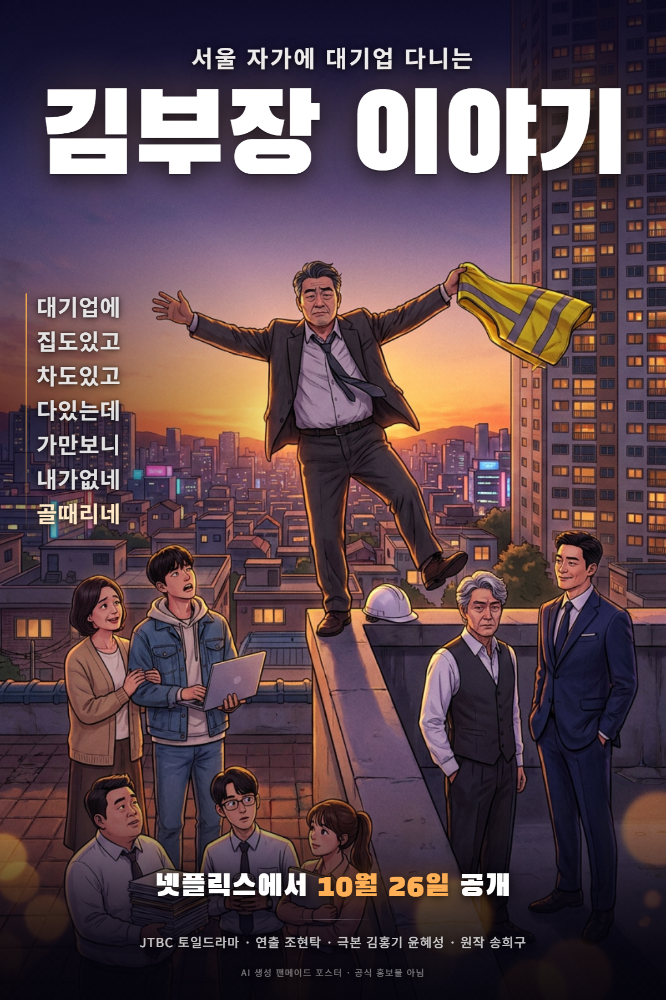

# 서울 자가에 대기업 다니는 김 부장 이야기

> 대기업에 / 집도있고 / 차도있고 / 다있는데 / 가만보니 / **내가없네** / 골때리네
>
> — 공식 포스터 카피

*(위 이미지는 이 폴더에서 만든 **AI 생성 팬메이드 포스터**입니다. 공식 홍보물이 아닙니다.)*

---

## 1. 한눈에 보기

| 항목 | 내용 |
|---|---|
| 원제 | 서울 자가에 대기업 다니는 김 부장 이야기 (줄여서 「김부장 이야기」) |
| 영제 | The Dream Life of Mr. Kim |
| 채널 | JTBC 토일 드라마 |
| 방영 | 2025년 10월 25일 ~ 11월 30일, **12부작** |
| 스트리밍 | 넷플릭스 (10월 26일 공개), TVING |
| 장르 | 오피스 · 일상 · 휴먼 · 사회고발 · 블랙코미디 |
| 연출 | 조현탁 |
| 극본 | 김홍기, 윤혜성 |
| 원작 | 송희구 소설 『서울 자가에 대기업 다니는 김 부장 이야기』 |
| 제작 | SLL, 드라마하우스 스튜디오, 바로엔터테인먼트 |
| 주연 | 류승룡, 명세빈, 차강윤 |
| 등급 | 15세 이상 시청가 |

---

## 2. 로그라인

> 자신이 가치 있다고 생각한 **모든 것을 한순간에 잃어버린 중년 남성**이,
> 긴 여정 끝에 마침내 '대기업 부장'이 아닌 **진짜 자기 자신**을 발견하게 되는 이야기.

## 3. 기획의도 (공식)

대한민국에서 '남들만큼' 산다는 건 쉽지 않다. 취업도 승진도 제때 해야 하고, 집도 차도 옷도 수준에 맞춰야 하고, 남들 노는 만큼 놀아야 하며, 그 와중에 자식도 좋은 대학에 보내야 한다. 그리고 이 모든 성취를 주변에 온·오프라인으로 **증명**해야 한다.

> "저, 성공했죠?" "행복한 거 맞죠?"

이 어려운 걸 해낸 사람이 바로 **김 부장**이다. 대기업 부장직에 번듯한 서울 자가, 자신을 이해해주는 아내와 자랑스러운 아들까지. 남 부러울 것 없는 완벽한 삶이었다. 이 행복을 위해 열심히 살아왔을 뿐인데… 전부라고 믿었던 것들이 하나둘 무너지기 시작한다.

---

## 4. 줄거리

ACT(통신 대기업) 영업1팀장 **김낙수 부장**. 입사 25년 차, 서울에 자가 아파트, 그랜저, 명문대 보낸 아들. 말끝마다 "25년 차 대기업 부장"을 붙이는 게 자부심이자 정체성이다.

하지만 시대는 그를 지나쳐 간다. 젊고 유능한 **도진우** 부장의 2팀에 실적이 밀리고, 유튜버의 폭로에 대기업의 힘으로 압박하려다 비웃음만 산다. 결국 20년 넘게 동고동락한 **백정태 상무**에게 배신당하듯 **아산 공장 안전관리팀장으로 좌천**된다.

정장 위에 노란 안전조끼를 걸치고, 혼자 구내식당에서 밥을 먹는 나날. 그러던 중 회사는 그에게 딜을 건다 — **공장 사람들을 안전규정 위반으로 내치면 본사로 복귀시켜 주겠다.** 임원으로 가는 마지막 사다리였다.

김 부장은 그 사다리를 걷어차고 **스스로 퇴사**한다. 이후 수익형 부동산 사기를 당하고, 끝내 서울 자가와 그랜저까지 처분해 경기도 빌라 월세로 이사한다. 한때 동료였던 이들의 차를 닦는 세차업으로 다시 시작하면서, 그는 '부장 김낙수'가 아닌 그냥 **김낙수**로 사는 법을 배워간다.

한편 아들 **김수겸**은 첫사랑이 있는 스타트업에 덜컥 들어갔다가 대표의 사기로 회사가 공중분해되고, 빚을 갚으려 장사를 시작하며 제 발로 창업의 길에 들어선다. 아내 **박하진**은 동생에게 무시당한 게 분해 얼결에 공인중개사 시험에 도전한다.

> 드라마 마지막 로고 색이 회차마다 바뀐다 — 1~6화 노랑(ACT 재직), 7화 주황(퇴사), 8~10화 빨강(부동산 사기), 11화부터 다시 노랑(집을 팔고 이사). 눈여겨볼 만한 연출 디테일.

---

## 5. 등장인물

### 김낙수와 가족

| 배역 | 배우 | 설명 |
|---|---|---|
| **김낙수** | 류승룡 | ACT 영업1팀장. 입사 25년 차 부장. 타이틀롤 |
| **박하진** | 명세빈 | 낙수의 아내. 주부 → 공인중개사 도전 |
| **김수겸** | 차강윤 | 아들. 대학생 → 스타트업 'CDO' → 창업 |
| 박하영 | 이세희 | 하진의 여동생 |
| 한상철 | 이강욱 | 하영의 남편. 핀테크 회사 대표 |
| 김창수 | 고창석 | 낙수의 형. 카센터 사장 |

### ACT (회사)

| 배역 | 배우 | 직책 |
|---|---|---|
| **백정태 (백상무)** | 유승목 | 영업본부장. 27년 차. 낙수와 20년 넘게 동고동락한 사이 |
| **도진우** | 이신기 | 영업2팀장. 19년 차. 젊고 유능한 라이벌 |
| 허태환 | 이서환 | 영업지원본부 과장. 25년 차. 낙수의 입사 동기 |
| **송익현** | 신동원 | 영업1팀 과장. 10년 차 |
| **정성구** | 정순원 | 영업1팀 대리. 6년 차 |
| **권송희** | 하서윤 | 영업1팀 사원. 3년 차 |
| 최재혁 | 이현준 | 인사팀장 |

### 그 외

| 배역 | 배우 | 설명 |
|---|---|---|
| 이한나 | 이진이 | 스타트업 'CDO' 이사. 수겸의 첫사랑 |
| 이정환 | 김수겸 | 'CDO' 대표 |
| 놈팽이 | 박수영 | 낙수의 초등학교 동창. 건물주 |

> **포스터 속 배치** — 중앙 난간 위 = 김낙수 / 왼쪽 = 박하진·김수겸 / 오른쪽 = 백정태·도진우 / 하단 = 영업1팀(송익현·정성구·권송희)

---

## 6. 시청률 (닐슨코리아, 전국)

| 회차 | 방영일 | 시청률 |
|---|---|---|
| 1회 | 10.25 | 2.9% |
| 6회 | 11.09 | 4.7% |
| 10회 | 11.23 | 5.4% |
| 11회 | 11.29 | 5.6% |
| **12회 (최종)** | 11.30 | **7.6%** |

첫 회 2.9%로 출발해 매주 우상향, 최종회에서 **7.6%(수도권 8.1%)** 로 자체 최고를 찍으며 첫 회 대비 약 3배 상승했다. TV 시청률 자체는 2025년 JTBC 드라마 중 낮은 편이었지만, **넷플릭스에서는 4화 만에 국내 TOP TV쇼 1위**를 차지하며 OTT에서 크게 터졌다.

## 7. OST

| 파트 | 곡명 | 아티스트 | 발매 |
|---|---|---|---|
| Part 1 | 혼자였다 | 이적 | 2025.10.26 |
| Part 2 | 나의 소년 | 권진아 | 2025.11.02 |
| Part 3 | 행진곡 | WOODZ | 2025.11.16 |

음악감독은 **정재형**.

## 8. 수상

- **제62회 백상예술대상(2026)** — 방송 부문 **대상: 류승룡** / 방송 부문 남자조연상: **유승목**
- 씨네21 올해의 시리즈(2025) — 올해의 남자배우: 류승룡

---

## 9. 평가

### 호평
- **류승룡의 연기.** 15년 만의 TV 드라마 복귀작에서 백상 대상까지 가져갔다. 명세빈의 연기도 극찬받았다.
- 조현탁 PD 특유의 섬세한 연출과 따스한 영상미, 정재형의 감성적인 음악.
- 원작과 떼놓고 보면 — **준비되지 않은 채 사회로 내몰리는 중장년 세대**를 그린 사회 풍자물로서는 완성도가 괜찮다는 평.
- 원작자 송희구가 촬영장을 자주 찾아 제작진과 직접 소통했다. (다른 웹소설 원작 드라마들이 소통 부재로 욕먹은 것과 대비)

### 혹평
- **원작 훼손 논란.** 원작은 김 부장–송 과장–정 대리–권 사원의 다중 시점(라쇼몽) 구조였는데, 드라마는 12부작으로 압축하며 사실상 김 부장 단일 서사로 바꿨다.
- **주인공 캐릭터의 전면 개조.** 원작의 김 부장은 "인성은 꼰대지만 능력만큼은 부서 에이스"였고, 그래서 *능력이 아니라 리더십(인화)이 부족했다*는 게 핵심 메시지였다. 드라마의 김 부장은 **능력 자체가 시대에 뒤떨어진 '짬부장'** 으로 하향됐고, 메시지도 "당신은 인화가 부족하다"에서 "당신은 역량이 부족하다"로 바뀌었다.
- 백상무와 도진우가 평면적인 악역으로 소비됐다는 지적. ("드라마화의 최대 피해자")
- **아들 김수겸 서사**가 원작과 접점 없는 독자 노선으로 크게 늘어난 데다, 연기력 논란까지 겹쳐 가장 많은 비판을 받았다.
- **오피스물 고증 부족.** 특히 아산 공장 묘사(대기업 생산직인데 반찬이 모자라 싸움 직전, 안전관리직을 하찮은 직책으로 묘사)가 비현실적이라는 비판. 중대재해예방협회가 안전관리 직군 비하라며 공식 비판하기도 했다.

### 명대사

> "명심해. 대기업 25년차 부장으로 살아남아서, 서울에 아파트 사고 애 대학까지 보낸 인생은 **위대한** 거야."

> "토종 한국인답게 살련다. 그거 무시하지 마. **위대한 거니까**." — 김수겸

---

## 10. 알아두면 재밌는 디테일

- **등장인물 이름 대부분이 만화 『슬램덩크』 한국어판에서 왔다.** 김홍기 작가가 슬램덩크 팬이라서. (김수겸·이정환·이한나·정성구·송익현·권송희…) 원작 소설에서는 '김부장', '송과장'처럼 **직급만 있고 풀네임이 없었다.**
- 배우 **김수겸**이 극중 김 부장의 아들 이름 **김수겸**의 상사(스타트업 대표 이정환)로 나온다. 이름이 겹치는 메타 개그.
- 유튜버 '아이티보이'의 인터넷 속도 폭로 장면은 **KT 10기가 인터넷 속도 저하 사건**이 모티브. 실제로 유튜버 잇섭에게 섭외 메일이 갔으나 본인이 놓쳐서 출연이 무산됐다고.
- **류승룡**은 〈개인의 취향〉 이후 **15년 만의 TV 드라마** 출연이다.
- 2026년 SBS 금토 드라마 〈김부장〉과는 **완전히 별개의 작품**이다. (그쪽은 웹툰 원작)

---

## 참고

- [나무위키 — 서울 자가에 대기업 다니는 김 부장 이야기(드라마)](https://namu.wiki/w/서울%20자가에%20대기업%20다니는%20김%20부장%20이야기(드라마))
- [위키백과](https://ko.wikipedia.org/wiki/서울_자가에_대기업_다니는_김_부장_이야기)
- [넷플릭스](https://www.netflix.com/title/82068378)

*정리일: 2026-07-14*
