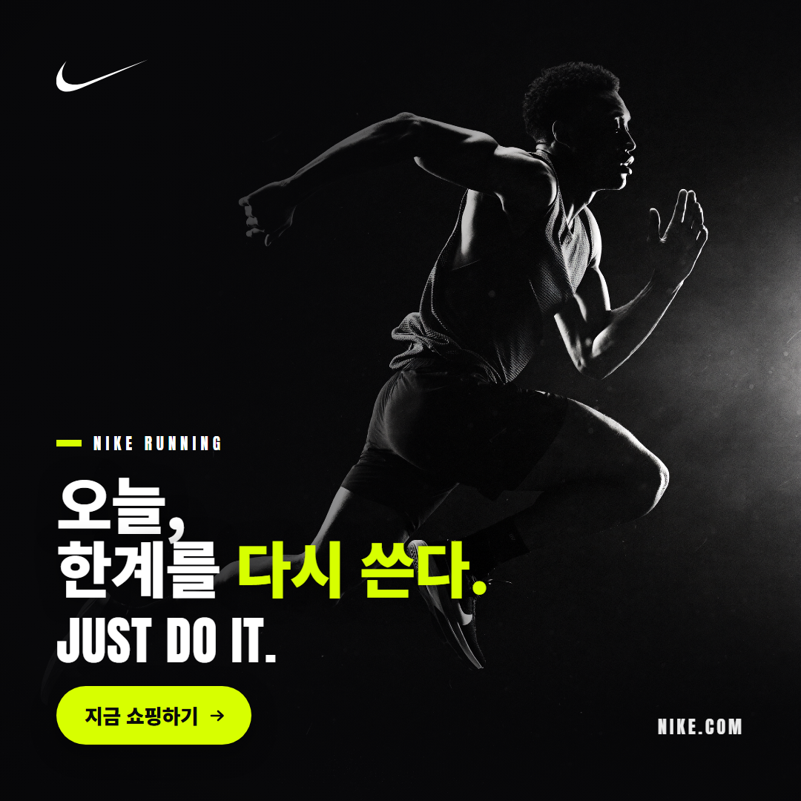
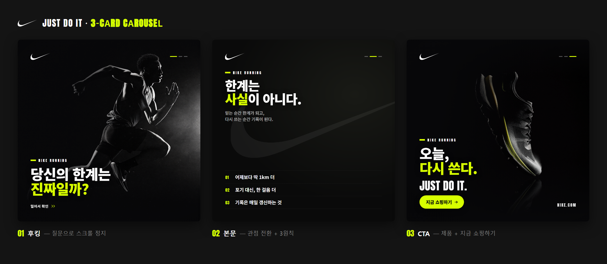

# Nike 인스타그램 광고 카드 — JUST DO IT (1080×1080)

스포츠 브랜드 **Nike**의 광고 컨셉을 레퍼런스로 확인하고, 공통된 톤앤매너를 지켜 만든
인스타그램 피드용 **정사각형(1080×1080)** 광고 카드입니다.



---

## 1. 브랜드 톤앤매너 (레퍼런스로 확인)

실제 Nike 광고/포스터 6종을 수집·확인했습니다 → [`refs/출처.md`](refs/출처.md)

| 요소 | Nike의 규칙 | 이 카드에 적용 |
|---|---|---|
| **컬러** | 검정 `#111`·흰색 `#FFF` 기본. 제품/액센트 컬러 **딱 하나**만 강하게 | 모노크롬 + **볼트 `#D7FF00`**(러닝 시그니처) 액센트 1개 |
| **폰트** | Futura Extra Bold Condensed(커스텀 "Futura ND"). "Just Do It"은 Futura Condensed Extra Black | 무료 대체체 **Anton**(영문) + **Noto Sans KR 900**(한글) |
| **슬로건** | **JUST DO IT** + Swoosh, 항상 함께 | Swoosh 마크(좌상단) + `JUST DO IT.` 슬로건 |
| **보이스** | 도전·한계 돌파·동기부여의 2인칭 메시지 | "오늘, 한계를 다시 쓴다." |
| **레이아웃** | 타이포 한쪽 / 인물 반대쪽 / 코너 워드마크 | 좌측 타이포 · 우측 러너 · 우하단 `NIKE.COM` |

> 근거: Nike 브랜드 컬러는 의도적으로 흑백 위주라 제품 컬러웨이가 주인공이 되게 하고,
> 슬로건은 동기부여·결단·탁월함의 추구를 압축합니다.
> (출처: [Mobbin](https://mobbin.com/colors/brand/nike) · [Envato — What font does Nike use](https://elements.envato.com/learn/what-font-does-nike-use))

## 2. 구조 (한 줄 카피 + 비주얼 + CTA)

```
┌──────────────────────────────────────┐
│  ✔ Swoosh                            │  ← 브랜드 마크
│                          (러너)       │  ← 비주얼(풀블리드)
│  ▍ NIKE RUNNING                      │  ← 아이브로우
│  오늘,                                │  ← ★ 한 줄 카피
│  한계를 다시 쓴다.                     │     (볼트 액센트)
│  JUST DO IT.                         │  ← 슬로건
│  ( 지금 쇼핑하기 → )        NIKE.COM  │  ← ★ CTA / 워드마크
└──────────────────────────────────────┘
```

- **한 줄 카피**: `오늘, 한계를 다시 쓴다.`
- **비주얼**: AI로 새로 생성한 흑백 러너 히어로 (익명·합성 인물)
- **CTA**: 볼트 컬러 알약 버튼 `지금 쇼핑하기 →`

## 3. 파일

| 파일 | 설명 |
|---|---|
| `nike_ad_1080.png` | **최종 결과물** (1080×1080) |
| `index.html` | 카드 소스 (1080×1080 캔버스) |
| `fonts_embed.css` | 서브셋 웹폰트 base64 임베드 (Anton·Noto Sans KR, 15KB) |
| `art/hero_v2_2048.png` | 히어로 비주얼 원본 (higgsfield soul_2 생성) |
| `refs/` | 톤앤매너 레퍼런스 6종 + 출처 |

## 4. 다시 렌더링하려면

`index.html`의 카피·색상을 고친 뒤:

```bash
chrome --headless=new --hide-scrollbars --force-device-scale-factor=1 \
  --window-size=1080,1080 --virtual-time-budget=5000 \
  --screenshot="nike_ad_1080.png" "index.html"
```

폰트가 파일에 임베드돼 있어 인터넷 없이도 동일하게 렌더됩니다.
(카피에 새 한글 글자를 추가하면 서브셋에 없을 수 있으니 `fonts_embed.css`를 다시 생성)

---

## 5. 3장 캐러셀 (후킹 → 본문 → CTA)

같은 브랜드 시스템(컬러·폰트·슬로건·Swoosh·볼트 액센트)을 그대로 유지하되,
슬라이드마다 **역할**과 **비주얼 리듬**을 다르게 설계했습니다.



| # | 역할 | 카피 | 비주얼 | 장치 |
|---|---|---|---|---|
| **1** | 후킹 | "당신의 한계는 진짜일까?" | 러너 히어로(사진) | 질문형 카피 + `밀어서 확인 »` 스와이프 유도 |
| **2** | 본문 | "한계는 사실이 아니다." + 3원칙 | 타이포 + 고스트 Swoosh | 1장의 질문에 답 → 관점 전환 + 스펙형 3원칙 |
| **3** | CTA | "오늘, 다시 쓴다." | 러닝화 제품컷(사진) | `JUST DO IT.` + `지금 쇼핑하기 →` 볼트 버튼 |

- **일관성 장치**: 세 장 모두 좌상단 Swoosh · 우상단 페이지 인디케이터(볼트 진행바) · `NIKE RUNNING` 아이브로우 · 볼트 액센트 1개.
- **리듬**: 사진 → 타이포 → 제품컷 으로 번갈아 배치해 넘길 때 지루하지 않게.
- **업로드**: 인스타 캐러셀은 `nike_carousel_1 → 2 → 3.png` 순서로 올리면 됩니다. (`carousel_preview.png`는 미리보기용)

### 캐러셀 파일
| 파일 | 설명 |
|---|---|
| `nike_carousel_1.png` `_2` `_3` | **최종 결과물** 3장 (각 1080×1080) |
| `slide-1.html` `slide-2` `slide-3` | 각 슬라이드 소스 |
| `carousel.css` | 3장 공용 브랜드 시스템 CSS |
| `carousel_preview.png` | 3장 필름스트립 미리보기 |
| `contact.html` | 미리보기 소스 |
| `art/shoe_a_2048.png` | CTA용 러닝화 제품컷 (higgsfield soul_2 생성) |

> 재렌더는 4번 항목과 동일하게 `slide-1/2/3.html`을 각각 스크린샷하면 됩니다.

---

### ⚠️ 저작권·상표 안내
- **Swoosh 로고**와 **"Just Do It"** 슬로건은 **Nike, Inc.** 의 등록상표입니다.
- 이 카드는 브랜드 일관성(컬러·폰트·슬로건)을 연습하기 위한 **부트캠프 학습용(비상업) 목업**이며, Nike의 공식 자료가 아닙니다. 배포·판매 대상이 아닙니다.
- 히어로 이미지는 특정 실존 인물을 복제하지 않은 **AI 생성 창작물**이고, 카피는 Nike의 실제 광고 문구가 아닌 **직접 작성한 오리지널**입니다.
