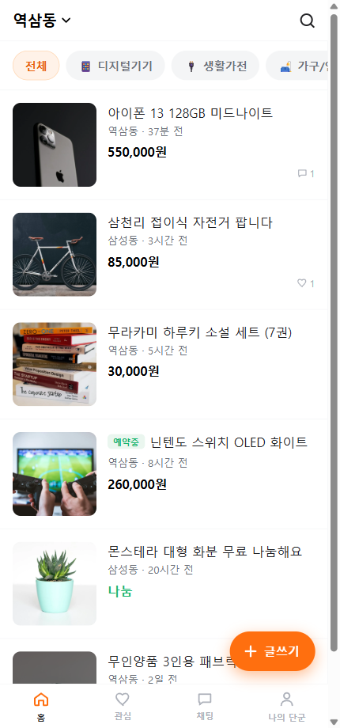

# 🥕 단군마켓 (Dangun Market)

당근마켓(Karrot) 클론 — **우리 동네 기반 중고 직거래 마켓**.
이름과 마스코트만 "단군"으로 바꾸고, 핵심 기능은 당근마켓을 그대로 재현했습니다.



## 기능 (요구 5개 파트 전부 구현)

| 파트 | 내용 | 구현 |
|---|---|---|
| **1. 회원가입 & 로그인** | 이메일 가입 + **동네 설정**(직접 입력 또는 위치 인증) | JWT 인증, 브라우저 GPS → 역지오코딩(동 이름 자동) |
| **2. 상품 등록** | 이미지(최대 3장) + 제목 + 가격 + 설명 + 카테고리, **본인만 수정/삭제** | ImageKit 업로드, 소유권은 서버 `WHERE user_id` 로 강제 |
| **3. 목록 & 상세** | 최신순 목록 + **카테고리 필터** + **키워드 검색**, 상세는 이미지 슬라이드·작성자·**관심 버튼** | 매너온도, 예약중/거래완료 상태, 조회수 |
| **4. 채팅 (1:1)** | 상세 "채팅하기" → 판매자와 1:1, **Polling 실시간** | 2.5초 주기 `?after=<id>` 증분 폴링 |
| **5. 마이페이지** | 내가 등록한 상품 / 관심 상품 / 채팅 목록 | 프로필·동네 변경·로그아웃 |

## 스택

- **프론트엔드**: 단일 `index.html` (CDN React 18 + Babel standalone, 해시 라우팅) — 빌드 도구 없음
- **백엔드**: `server.js` (Express 5 + JWT + pg)
- **DB**: Supabase PostgreSQL — 공유 DB라 모든 테이블에 `dangun_` prefix
- **이미지**: ImageKit (서버가 업로드 서명만 발급, 클라가 직접 업로드 → 이미지 바이트는 서버를 안 거침)
- **위치 인증**: OpenStreetMap Nominatim (키 불필요, 서버가 대리 호출)

## 실행 방법

```bash
npm install
npm run migrate     # dangun_* 테이블 생성 (여러 번 실행해도 안전)
npm run seed        # (선택) 데모 상품 6개 + 채팅 시드
npm start           # → http://localhost:3000
```

> ⚠️ **반드시 `http://localhost:3000` 으로 접속하세요.** Live Server(5500) 등으로 열면 `/api/*` 가 전부 404 입니다.

### 데모 계정 (seed 실행 시)

```
이메일:   dangun.demo@dangun.test
비밀번호: demo1234
닉네임:   단군이 (역삼동)
```

## 검증

- `npm run smoke` — 실제 서버 + 실제 Supabase DB 로 31개 항목 E2E (목 없음)
  회원가입·로그인·상품 CRUD·이미지 URL 보안·검색/필터·관심 토글·채팅 왕복·polling·소유권 가드까지.
- 브라우저 검증(Playwright) — 콘솔 에러 0, 로그인→홈→상세→채팅(전송)→마이페이지 흐름 확인. `screenshots/` 참고.

## 파일 구조

```
6_carrot_market/
├── index.html          # 프론트엔드 전체 (단일파일 React)
├── server.js           # API 서버 (인증·상품·관심·채팅·이미지서명·위치)
├── db.js               # pg 연결 (특수문자 비번 대응 URL 분해)
├── schema.sql          # dangun_* 테이블
├── assets/dangun-icon.svg   # 단군 마스코트
├── scripts/
│   ├── migrate.js      # 스키마 적용
│   ├── seed.js         # 데모 데이터
│   └── smoke.js        # E2E 검증
└── .env                # 키 (git 제외) — SUPABASE_DB_URL / JWT_SECRET / IMAGEKIT_*
```

## 보안 메모

- 정적 서빙은 **allowlist**(`index.html` 만) — `express.static` 으로 폴더를 열면 `GET /.env` 로 키가 샙니다.
- 상품 이미지 URL은 우리 ImageKit 엔드포인트로 시작하는 것만 저장(임의 URL 차단).
- pooler 연결은 RLS를 우회하므로, "본인만" 규칙은 전부 SQL `WHERE user_id = $N` 으로 강제.
